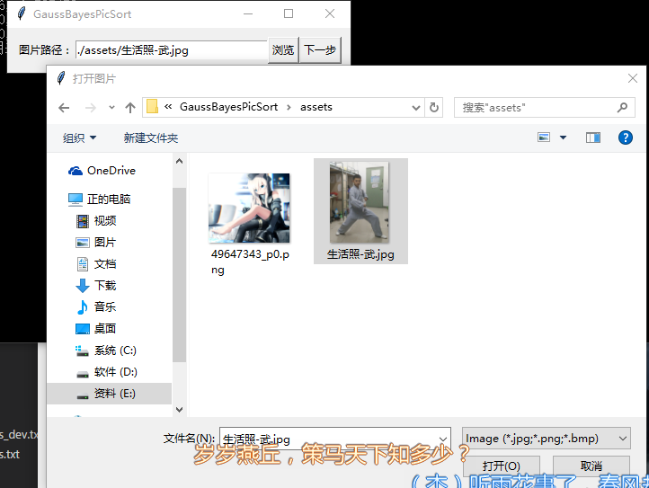
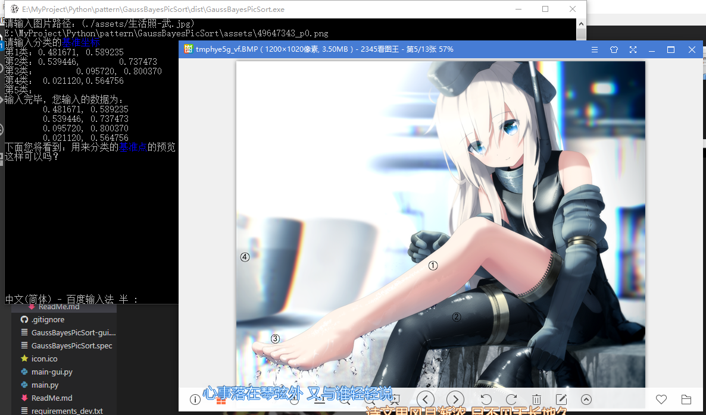
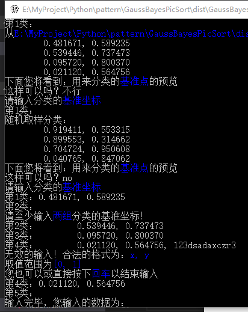
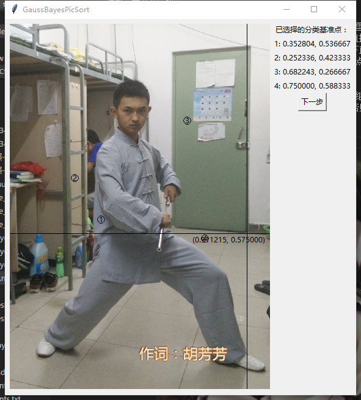
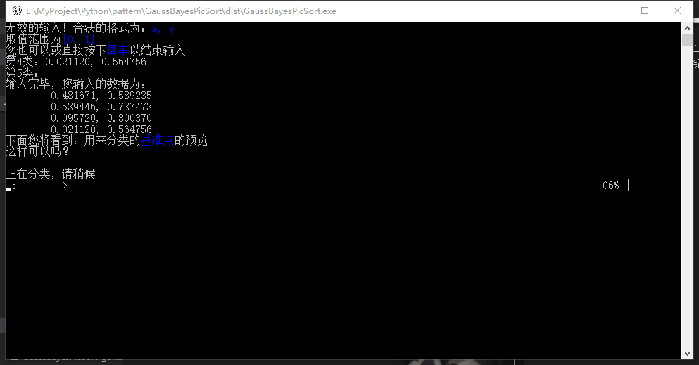
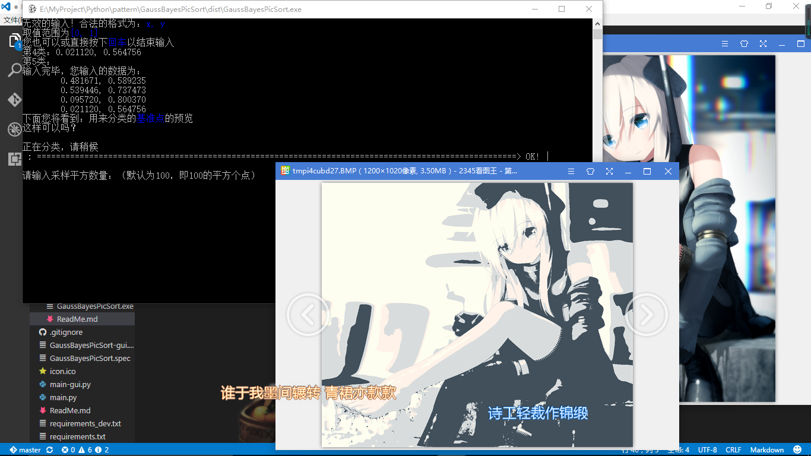
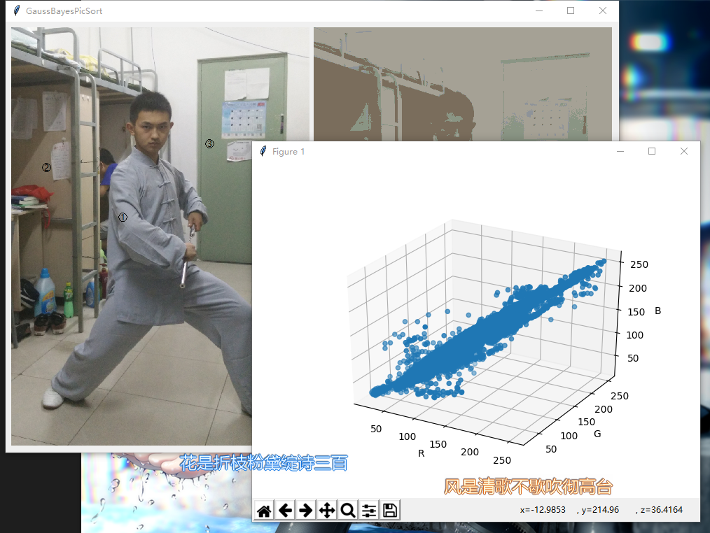

# GaussBayesPicSort
## 模式识别大作业 - 图片的贝叶斯分类器分类

***
### 使用流程及应用展示：

#### 1. 选择图片：

- 控制台版本从命令行输入

    

    当直接回车时将读取默认路径图片（./assets/生活照-武.jpg）,相对路径是从打开程序的文件夹开始的，若输入路径无效或不可读将继续询问输入

- GUI从文件浏览器选择

    

    也可以直接在输入框输入，当确认选择后点下一继续

#### 2. 选择分类基准点

- 控制台在命令行输入

    

    输入格式为'x, y'，即输入横坐标加逗号加纵坐标，前后及坐标逗号间空格均无严格要求，回车录入一个点的坐标，至少输入两个点后，直接回车结束输入，也可以继续输入更多的点。若一个点都不输入的情况下直接回车，会自动在图片路径下查找同名的csv数据文件，从中读入坐标点。对于无效的输入会给出提示，并重新输入该点。

    

    输入完毕后，会在 图片上标出选取的基准坐标点，询问是否可以继续。若检测到用户输入关键词“否”、“不”、“N”，“n”,则重新录入，否则继续下一步，

- GUI在图片上点选

    

    鼠标移动到图片上可以看到当前坐标，点击左键即可录入该点，至少录入两点后，右侧会出现下一步按钮，可以点击进行下一步，当然也可以继续选择

#### 3. 开始分类

- 控制台分类

    
    
    
    
    这没啥好解释的，等待进度条到100%分类完毕就好了

- GUI分类

    
    
    
    
    同样没啥好解释的，等图片分类完毕就好了

#### 4. 特征空间绘制

- 控制台输入取样平方数量

    

    取样平方数量是为了防止图片较大的情况下绘制的点过多，这里输入了80，表示长宽方向各取80个点，即总共抽取 80 × 80 = 6400 个点来绘制特征空间。默认值如图，100。

- GUI输入平方采样数量

    

    同控制台版本，这里取了默认值100，即绘制了10000个样本点。且这里的坐标轴方向才是默认的坐标轴方向，x、y、z轴沿右手螺旋方向首尾相接，之前那个图里的坐标轴是我扰数值轴顺时针旋转90度了的。

***
### 理论详解 & 问题讨论
首先，题目要求为将图片分成4类，但我这里的设计实际上可以分成任意多的类（大于等于2）

假设条件为每类别先验概率相等，具体怎么个相等法我也不知道，既然是假设，那就干脆由用户输入好了，所以设计就变成了用户随便输入几个分类的基准坐标点，因为假设先验概率相等所以我就不验证用户选择的这几个点是否合理咯，如果他真的就选了几个色值相近的点那也没办法。

然后开始对图片分类，这里我只取了RGB作为特征值，忽略了Alpha通道，一方面很多图片本身就是没有透明度的，另一方面只有3个坐标轴也方便后面的特征空间的绘制，不然四维特征空间怎么画？难不成用时间轴代替Alpha轴做成动画？（手动滑稽）

分类完成后就是特征空间的绘制了。这里遇到的问题就是当取样的点太多是，Python的Matplotlib库有点响应不过来，所以加入了“平方取样数量”这个概念，简单的说就是如果这个值为100那么我就在长宽方向上各等距划分100个点，总计得到100的2次方即10000个样本点，然后绘制它们的特征矢量。

作品完成后我们看到，对于我自己的照片，分类效果不是很好，但对于CG插画效果就很棒。原因大概是，照片较模糊，每个肉眼可识别的点上其实由多个不尽相同的像素构成，而分类时这些像素就会时而分入A类时而分入B类，造成较大的噪点。CG插画是计算机上色，颜色干净，饱和度高，分类效果自然就好多了。

***
### 最后，展示下当分类点足够多时的效果！

